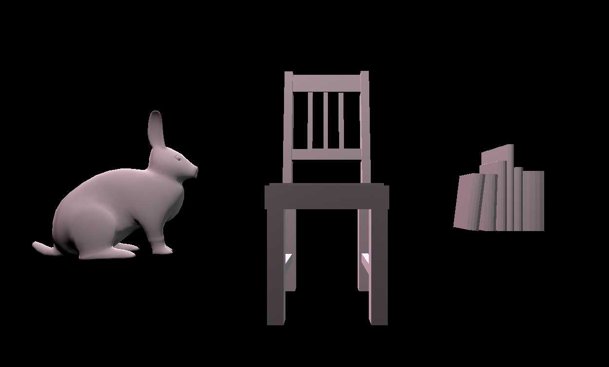

# CMPM163Labs

# Lab 2

video:https://drive.google.com/open?id=1ptXlOwkoLHP4vuiW9GVLfB6Wqekg8VEm

# Lab 3

video:https://drive.google.com/file/d/1QrkQ1XSuOTLpwfDTFgoM1YgXB9tqDqIZ/view?usp=sharing

1. The first cube on the left is made by mixing two colors together based on the time the program has been running. It utilizes a sin function so the colors will slide from one color, to a mix of colors, and finally to the other.

2. The second cube is made based on the lab code by utilizing a shader to mix two colors together based on the location of the vertices of the object the marterial is applied to

3. The third cube from the left is based on the lab notes and is a green spining cube created by using th phong materials in three.js
 
4. The last cube was made using the phong materials in three.js where I changed some setting such as raising the shininess and added a slight emission
