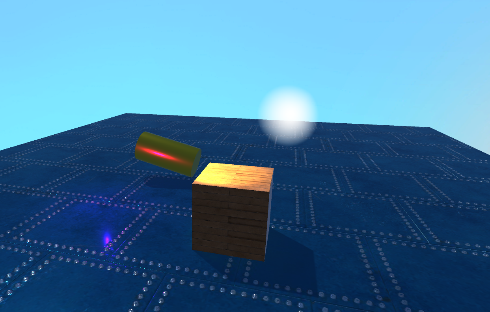

# CMPM163Labs

# Lab 2

video:https://drive.google.com/open?id=1ptXlOwkoLHP4vuiW9GVLfB6Wqekg8VEm

# Lab 3

video:https://drive.google.com/file/d/1QrkQ1XSuOTLpwfDTFgoM1YgXB9tqDqIZ/view?usp=sharing

1. The first cube on the left is made by mixing two colors together based on the time the program has been running. It utilizes a sin function so the colors will slide from one color, to a mix of colors, and finally to the other.

2. The second cube is made based on the lab code by utilizing a shader to mix two colors together based on the location of the vertices of the object the marterial is applied to

3. The third cube from the left is based on the lab notes and is a green spining cube created by using th phong materials in three.js
 
4. The last cube was made using the phong materials in three.js where I changed some setting such as raising the shininess and added a slight emission

# Lab 4

video: https://drive.google.com/file/d/1OQUsre1bOhzIa84v-nBoGs5VOFT-KwsI/view?usp=sharing

From Left to Right

1. This is the  tiling cube. To create this one I set tge texture to RepeatWrapping and set the repeat setting to 4 (I wanted a 4x4 grid) and in the shader I scaled down the UV vector by .25 so that each square was the correct size.

2. This cube was created by using the THREE.MeshPhongMaterial function and loading a texture and a normal map to create depth

3. This was the first cube and it was made by loading a texture into the phong material function in THREE.JS

4. This cube was created by using the THREE.MeshPhongMaterial function and loading a texture and a normal map to create depth

5. This cube was created by loading a texture with shader code

* UV Questions

A. (u x 8) - 1 = x

B. (v x 8) - 1 = y

C. White (2,1)

# Lab 5

Video: https://drive.google.com/file/d/1BiC99oQ1CA9CFCVMq9lRbLrXCgHWTOaj/view?usp=sharing

# Lab 6

Types of light:

Point Light:Lights that emmit light in all directions from a given point and are unaffected by rotation.

Directional Light: A light that simmulates being emmited from a source infinetly far away and is unaffected by position.

Spot Light: A light that emmits in a cone shape that is affected by both rotation and position.

Area Light: Emmits baked light in a rectangular shape that is effected by both rotation and position.

Material:
I created a gold like material using the built in unity shader. I choose a orangish yellow base color and rased both the metallic and roughness levels up closer to 1.

Textures:
1) I created the blue metal textured floor by using free texture maps from https://3dtextures.me/2020/05/04/metal-plate-042/ and applied them to the different slots on the basic material shader

2)I created the wood planks textured cube by using free texture maps from https://3dtextures.me/2019/07/05/wood-planks-012/ and applied them to the different slots on the basic material shader

Skybox:
I created the sky box by creating 6 individual sky textures in photoshop. Then I made a new skybox texture and applied each texture to a different side of the skybox (weirdly the left and right sides are swithced in unity).

